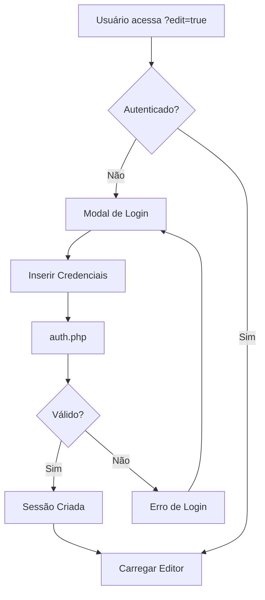
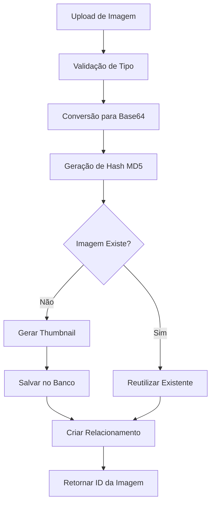

# 🏗️ SISTEMA HARDEM - DOCUMENTAÇÃO TÉCNICA COMPLETA

## 📋 RESUMO EXECUTIVO

O **Sistema HARDEM** é um CMS (Content Management System) completo para websites de construção civil, desenvolvido como uma solução all-in-one que combina:

- **Template HTML responsivo** para empresas de construção
- **Editor in-line avançado** para edição de conteúdo em tempo real
- **Sistema de gerenciamento de imagens e textos** com banco de dados
- **Painel administrativo** para gestão completa do site
- **Sistema de backup e restauração** de dados

---

## 🎯 VISÃO GERAL DO SISTEMA

### Público-Alvo
- Empresas de construção civil
- Construtoras e empreiteiras  
- Arquitetos e engenheiros
- Profissionais do setor imobiliário

### Funcionalidades Principais
- ✅ Site completo com múltiplas páginas (60+ templates)
- ✅ Editor visual in-line para edição sem código
- ✅ Gerenciamento completo de imagens via banco de dados
- ✅ Sistema de autenticação seguro
- ✅ Painel administrativo avançado
- ✅ Backup automático de dados
- ✅ Design responsivo e moderno

---

## 🏗️ ARQUITETURA TÉCNICA

### Stack Tecnológico

#### Frontend
- **HTML5** - Estrutura das páginas
- **CSS3/SCSS** - Estilização avançada com pré-processador
- **JavaScript ES6+** - Funcionalidades interativas e editor
- **Bootstrap 5** - Framework CSS responsivo
- **AOS** - Animações on scroll
- **Swiper.js** - Carrosséis e sliders

#### Backend  
- **PHP 8+** - Linguagem principal do servidor
- **MySQLi/MariaDB** - Banco de dados principal
- **JSON** - Sistema de fallback para dados
- **Sessões PHP** - Gerenciamento de autenticação

#### Bibliotecas e Plugins
- **FontAwesome** - Ícones
- **Magnific Popup** - Lightbox para imagens
- **Odometer** - Contadores animados
- **MetisMenu** - Menus responsivos
- **Cheerio (Node.js)** - Manipulação de HTML

---

## 📁 ESTRUTURA DE DIRETÓRIOS

```
HARDEM-html/
├── 📄 Páginas HTML (60+ arquivos)
│   ├── index.html                    # Página inicial
│   ├── about.html                    # Sobre a empresa
│   ├── service.html                  # Serviços
│   ├── contact.html                  # Contato
│   ├── project*.html                 # Portfólio (20+ variações)
│   ├── blog*.html                    # Blog e artigos
│   ├── admin*.html                   # Painéis administrativos
│   └── ... (outras páginas)
│
├── 📂 assets/                        # Recursos estáticos
│   ├── css/                          # Estilos
│   │   ├── style.css                 # CSS principal (compilado)
│   │   ├── plugins/                  # Plugins CSS
│   │   └── vendor/                   # Bibliotecas externas
│   ├── js/                           # Scripts JavaScript
│   │   ├── main.js                   # Script principal
│   │   ├── editor-manager.js         # Gerenciador do editor
│   │   ├── editor/                   # Módulos do editor
│   │   ├── plugins/                  # Plugins JS
│   │   └── vendor/                   # Bibliotecas externas
│   ├── images/                       # Imagens do template
│   ├── fonts/                        # Fontes web
│   └── scss/                         # Arquivos SASS
│
├── 📂 classes/                       # Classes PHP
│   ├── Database.php                  # Gerenciamento de banco
│   ├── DatabaseJSON.php             # Fallback JSON
│   └── ImageManager.php              # Gerenciamento de imagens
│
├── 📂 config/                        # Configurações
│   └── database.php                  # Config do banco
│
├── 📂 data/                          # Dados JSON (fallback)
│   ├── textos.json                   # Textos editados
│   ├── imagens.json                  # Metadados de imagens
│   ├── pagina_imagens.json           # Relação página-imagem
│   ├── backups.json                  # Backups dos dados
│   └── system_logs.json              # Logs do sistema
│
└── 📄 Scripts e APIs
    ├── auth.php                      # API de autenticação
    ├── api-admin.php                 # API administrativa
    ├── save-database.php             # Salvamento de dados
    ├── serve-image.php               # Servidor de imagens
    ├── mailer.php                    # Envio de emails
    └── *.js                          # Scripts de processamento
```

---

## 🔐 SISTEMA DE AUTENTICAÇÃO

### Credenciais de Acesso
- **Usuário:** `Hardem`
- **Senha:** `Hardem@321`
- **Timeout da Sessão:** 3600 segundos (1 hora)

### URLs de Acesso Administrativo

#### 1. **auth.php** - API Principal
- **Função:** Gerenciamento de autenticação
- **Métodos:** POST
- **Ações:**
  - `action=login` - Realizar login
  - `action=logout` - Fazer logout
  - `action=check` - Verificar autenticação

#### 2. **admin.html** - Painel Básico
- **Função:** Interface administrativa simples
- **Recursos:** Lista de páginas, navegação para edição

#### 3. **admin-panel.html** - Painel Avançado
- **Função:** Interface administrativa completa
- **Recursos:** 
  - Dashboard com estatísticas
  - Gestão de imagens e textos
  - Sistema de backup
  - Tabelas de controle

#### 4. **test-login.html** - Página de Testes
- **Função:** Interface para testar funcionalidades de login
- **Recursos:** Debug visual, teste de conectividade

### Fluxo de Autenticação



---

## 🎨 SISTEMA DE EDIÇÃO IN-LINE

### Editor Manager (`editor-manager.js`)

O sistema utiliza um gerenciador inteligente que:

1. **Detecta URLs de Edição** - Monitora parâmetro `?edit=true`
2. **Valida Autenticação** - Verifica com `auth.php`
3. **Carrega Editor** - Ativa módulos de edição quando necessário
4. **Preserva Performance** - Só carrega recursos em modo de edição

### Módulos do Editor

#### Core (`editor-core.js`)
- **Função:** Coordenação geral
- **Recursos:** Estado global, inicialização, observer de DOM

#### UI (`editor-ui.js`) 
- **Função:** Interface do usuário
- **Recursos:** Toolbar, painel lateral, estilos CSS

#### Text (`editor-text.js`)
- **Função:** Edição de textos
- **Recursos:** Edição inline, duplo-clique, elementos de texto

#### Image (`editor-image.js`)
- **Função:** Edição de imagens
- **Recursos:** Upload, backgrounds, redimensionamento

#### Carousel (`editor-carousel.js`)
- **Função:** Edição de carrosséis
- **Recursos:** Gerenciamento de slides, upload para sliders

#### Storage (`editor-storage.js`)
- **Função:** Persistência de dados
- **Recursos:** LocalStorage, sincronização com servidor

#### Utils (`editor-utils.js`)
- **Função:** Utilitários compartilhados
- **Recursos:** Helpers DOM, validações, data-keys

### Funcionalidades de Edição

- ✅ **Edição de Texto**: Duplo-clique para editar qualquer texto
- ✅ **Upload de Imagens**: Substituição de imagens por drag-and-drop
- ✅ **Edição de Backgrounds**: Alteração de imagens de fundo
- ✅ **Gerenciamento de Carrosséis**: Adição/remoção de slides
- ✅ **Preview em Tempo Real**: Visualização instantânea das mudanças
- ✅ **Salvamento Automático**: Backup contínuo no LocalStorage

---

## 💾 SISTEMA DE BANCO DE DADOS

### Configuração Principal

**Arquivo:** `config/database.php`
```php
[
    'host' => 'localhost',
    'port' => 3306,
    'database' => 'hardem_editor',
    'username' => 'root',
    'password' => '123',
    'charset' => 'utf8mb4'
]
```

### Estrutura de Tabelas

#### Tabela `imagens`
```sql
- id (PRIMARY KEY)
- nome_arquivo (VARCHAR)
- nome_original (VARCHAR)
- tipo_mime (VARCHAR)
- tamanho (INT)
- largura (INT)
- altura (INT)
- dados_base64 (LONGTEXT)      # Imagem completa em base64
- thumbnail_base64 (LONGTEXT)   # Thumbnail em base64
- hash_md5 (VARCHAR)
- alt_text (VARCHAR)
- descricao (TEXT)
- url_externo (VARCHAR)         # Para URLs externas
- status (ENUM: 'ativo', 'inativo')
- created_at (TIMESTAMP)
- updated_at (TIMESTAMP)
```

#### Tabela `textos`
```sql
- id (PRIMARY KEY)
- data_key (VARCHAR)            # Identificador único do elemento
- conteudo (TEXT)               # Texto editado
- conteudo_original (TEXT)      # Backup do texto original
- tipo_elemento (VARCHAR)       # h1, p, span, etc.
- pagina (VARCHAR)              # Página onde está o texto
- status (ENUM: 'ativo', 'inativo')
- created_at (TIMESTAMP)
- updated_at (TIMESTAMP)
```

#### Tabela `pagina_imagens` (Relacionamento)
```sql
- id (PRIMARY KEY)
- imagem_id (FOREIGN KEY)
- pagina (VARCHAR)
- contexto (VARCHAR)            # slide, background, content, etc.
- posicao (INT)                 # Ordem na página
- created_at (TIMESTAMP)
```

### Sistema de Fallback JSON

Quando MySQL não está disponível, o sistema utiliza arquivos JSON:

- **`data/imagens.json`** - Metadados das imagens
- **`data/textos.json`** - Textos editados
- **`data/pagina_imagens.json`** - Relacionamentos
- **`data/backups.json`** - Backups automáticos
- **`data/system_logs.json`** - Logs do sistema

---

## 🖼️ GERENCIAMENTO DE IMAGENS

### Características Principais

1. **Armazenamento 100% no Banco** - Sem arquivos físicos
2. **Formato Base64** - Imagens codificadas diretamente no banco
3. **Thumbnails Automáticos** - Geração automática de miniaturas
4. **Deduplicação por Hash** - Evita imagens duplicadas
5. **Suporte Multi-formato** - JPEG, PNG, GIF, WebP, SVG

### Fluxo de Upload



### API de Imagens (`serve-image.php`)

**Endpoints:**
- `serve-image.php?id=123&type=original` - Imagem completa
- `serve-image.php?id=123&type=thumbnail` - Miniatura
- `serve-image.php?id=123&download=1` - Download da imagem

---

## 🔧 API ADMINISTRATIVA

### Arquivo Principal: `api-admin.php`

**Funcionalidades:**

#### Estatísticas
- `GET /api-admin.php?action=get_stats` - Estatísticas gerais

#### Imagens
- `GET /api-admin.php?action=get_images` - Listar imagens
- `POST /api-admin.php?action=update_image` - Atualizar imagem
- `POST /api-admin.php?action=delete_image` - Deletar imagem
- `POST /api-admin.php?action=replace_image` - Substituir imagem
- `POST /api-admin.php?action=put_image` - Adicionar nova imagem

#### Textos
- `GET /api-admin.php?action=get_texts` - Listar textos
- `POST /api-admin.php?action=update_text` - Atualizar texto
- `POST /api-admin.php?action=delete_text` - Deletar texto

#### Elementos
- `POST /api-admin.php?action=update_element_properties` - Propriedades de elementos

### Sistema de Logs

**Arquivo:** `hardem-editor.log`
- Registra todas as operações importantes
- Formatação timestamped
- Separação por módulos [API-ADMIN], [AUTH], etc.

---

## 📱 PÁGINAS E TEMPLATES

### Páginas Principais

#### 🏠 **index.html** - Página Inicial
- Hero section com vídeo/slider
- Seção de serviços
- Sobre a empresa
- Portfólio em destaque
- Depoimentos de clientes
- Call-to-action

#### ℹ️ **about.html** - Sobre Nós
- História da empresa
- Missão, Visão e Valores
- Equipe
- Certificações

#### 🔧 **service.html** - Serviços
- Lista completa de serviços
- Páginas individuais de serviços (5 variações)
- Processo de trabalho
- Orçamento online

#### 📁 **Portfólio** (20+ variações)
- `project.html` - Lista geral de projetos
- `project-details.html` - Detalhes do projeto
- `project-gallery.html` - Galeria de imagens
- `project-slider.html` - Apresentação em slider
- Múltiplas variações de layout (2, 3, 4 colunas)

#### 📝 **Blog** (3 layouts)
- `blog-grid.html` - Layout em grade
- `blog-list.html` - Layout em lista
- `blog-details.html` - Página do artigo

#### 📞 **contact.html** - Contato
- Formulário de contato
- Informações da empresa
- Mapa integrado
- Redes sociais

### Páginas Especiais

- **404.html** - Página de erro personalizada
- **coming-soon.html** - Em breve
- **privacy-policy.html** - Política de privacidade
- **terms-of-condition.html** - Termos de uso

---

## 🎨 SISTEMA DE ESTILOS

### Arquitetura CSS

#### SCSS Estruturado (`assets/scss/`)
```
scss/
├── style.scss                    # Arquivo principal
├── default/                      # Configurações básicas
│   ├── _variables.scss           # Variáveis CSS
│   ├── _mixins.scss              # Mixins reutilizáveis
│   ├── _animations.scss          # Animações
│   └── _base.scss                # Estilos base
├── elements/                     # Componentes específicos
│   ├── _header.scss              # Cabeçalho
│   ├── _footer.scss              # Rodapé
│   ├── _buttons.scss             # Botões
│   ├── _forms.scss               # Formulários
│   └── ... (40+ componentes)
└── header/                       # Estilos do header
    ├── _header.scss
    ├── _dropdown.scss
    └── _mobile-menu.scss
```

#### CSS Compilado
- **`assets/css/style.css`** - CSS principal (300KB+)
- **`assets/css/plugins/`** - Plugins CSS
- **`assets/css/vendor/`** - Bibliotecas externas

### Responsividade
- **Mobile First** - Design pensado para mobile
- **Breakpoints Bootstrap** - Compatibilidade com Bootstrap 5
- **Flexbox e Grid** - Layout moderno
- **Touch Friendly** - Elementos adequados para toque

---

## ⚡ SISTEMA DE PERFORMANCE

### Otimizações Implementadas

#### Loading Instantâneo
```css
/* assets/css/instant-loading.css */
- Loading screen customizado
- Animações suaves de carregamento
- Preloader inteligente
```

#### Carregamento Condicional
- **Editor só carrega quando necessário** (`?edit=true`)
- **Scripts modularizados** - Carregamento sob demanda
- **Lazy loading** para imagens pesadas
- **Preload de recursos críticos**

#### Compressão e Minificação
- **CSS minificado** em produção
- **JavaScript otimizado** por módulos
- **Imagens otimizadas** em WebP quando possível

---

## 🔄 SISTEMA DE BACKUP

### Backup Automático

#### Scripts de Backup
- **`backup-database.ps1`** - PowerShell para Windows
- **`backup-database.sh`** - Bash para Linux/Mac
- **`restore-database.sh`** - Restauração de backup

#### Dados Inclusos no Backup
- ✅ Textos editados
- ✅ Metadados de imagens
- ✅ Relacionamentos página-imagem
- ✅ Configurações do sistema
- ✅ Logs importantes

#### Formato de Backup
```json
{
  "timestamp": "2024-01-15T10:30:00Z",
  "version": "1.0.0",
  "data": {
    "textos": [...],
    "imagens": [...],
    "pagina_imagens": [...],
    "system_info": {...}
  }
}
```

### Restauração de Dados
- **Restauração completa** - Todos os dados
- **Restauração seletiva** - Apenas textos ou imagens
- **Validação de integridade** - Verificação antes da restauração

---

## 🛠️ SCRIPTS DE DESENVOLVIMENTO

### Node.js Scripts (`package.json`)

```json
{
  "scripts": {
    "add-editor": "node apply-editor-to-all-pages.js",
    "add-keys": "node add-data-keys.js", 
    "setup": "npm install && npm run add-keys && npm run add-editor",
    "serve": "npx http-server . -p 8000",
    "process-all": "node process-all-pages.js"
  }
}
```

#### Scripts Disponíveis

1. **`apply-editor-to-all-pages.js`**
   - Aplica sistema de edição a todas as páginas HTML
   - Remove scripts antigos
   - Adiciona novo editor-manager

2. **`process-all-pages.js`** 
   - Processa todas as páginas do site
   - Adiciona data-keys para elementos editáveis
   - Normaliza estrutura HTML

3. **Dependências**
   - `cheerio` - Manipulação de HTML server-side
   - `http-server` - Servidor de desenvolvimento

---

## 📧 SISTEMA DE EMAIL

### Arquivo: `mailer.php`

**Funcionalidades:**
- Processamento de formulários de contato
- Envio de emails via PHP mail()
- Validação de dados de entrada
- Proteção contra spam

**Campos Suportados:**
- Nome do contato
- Email
- Telefone  
- Assunto
- Mensagem
- Empresa (opcional)

---

## 🔒 SEGURANÇA

### Medidas Implementadas

#### Autenticação
- ✅ **Sessões PHP seguras** - Controle de tempo de sessão
- ✅ **Verificação constante** - Validação em cada requisição
- ✅ **Timeout automático** - Logout após inatividade
- ✅ **Sanitização de dados** - Escape de entrada

#### API Security
- ✅ **Headers CORS** configurados
- ✅ **Validação de métodos HTTP**
- ✅ **Tratamento de erros** sem exposição de dados sensíveis
- ✅ **Logs de segurança** para auditoria

#### Upload de Arquivos
- ✅ **Validação de tipo MIME**
- ✅ **Limite de tamanho** (10MB por arquivo)
- ✅ **Verificação de extensões**
- ✅ **Armazenamento no banco** (sem arquivos físicos)

### Recomendações de Segurança

⚠️ **Para Produção:**
1. Alterar credenciais hardcoded
2. Implementar HTTPS obrigatório
3. Adicionar rate limiting
4. Configurar firewall adequado
5. Backup regular dos dados

---

## 🚀 INSTALAÇÃO E CONFIGURAÇÃO

### Requisitos do Sistema

#### Servidor
- **PHP 8.0+** com extensões:
  - MySQLi
  - GD (para processamento de imagens)
  - JSON
  - Session
- **MySQL/MariaDB 10.0+**
- **Apache/Nginx** com mod_rewrite

#### Cliente (Desenvolvimento)
- **Node.js 16+** (para scripts de desenvolvimento)
- **Navegador moderno** (Chrome, Firefox, Safari, Edge)

### Passos de Instalação

1. **Clone/Download do projeto**
2. **Configurar banco de dados**
   ```php
   // config/database.php
   'host' => 'seu_host',
   'database' => 'sua_database', 
   'username' => 'seu_usuario',
   'password' => 'sua_senha'
   ```

3. **Criar tabelas do banco**
   ```bash
   php create-main-tables.php
   ```

4. **Instalar dependências Node.js** (opcional)
   ```bash
   npm install
   ```

5. **Configurar servidor web** apontando para o diretório raiz

6. **Acessar sistema**
   - Site: `http://seudominio.com`
   - Admin: `http://seudominio.com/admin.html`
   - Edição: `http://seudominio.com/index.html?edit=true`

---

## 📊 ESTATÍSTICAS DO PROJETO

### Tamanhos de Arquivos
- **Total do Projeto:** ~15MB
- **HTML Templates:** 60+ arquivos (5-150KB cada)
- **JavaScript:** ~500KB (todos os módulos)
- **CSS:** ~300KB (compilado)
- **Imagens do Template:** ~50MB
- **Log do Sistema:** 1.1MB

### Linhas de Código
- **JavaScript:** ~15.000 linhas
- **PHP:** ~3.000 linhas  
- **HTML:** ~100.000 linhas (todos os templates)
- **SCSS:** ~20.000 linhas

### Funcionalidades
- ✅ **60+ páginas HTML** funcionais
- ✅ **8 módulos JavaScript** do editor
- ✅ **3 classes PHP** principais
- ✅ **4 APIs REST** para administração
- ✅ **Sistema completo de backup**
- ✅ **Documentação detalhada**

---

## 🐛 TROUBLESHOOTING

### Problemas Comuns

#### 1. **Editor não carrega**
**Sintomas:** Não aparece toolbar de edição
**Soluções:**
- Verificar se URL contém `?edit=true`
- Verificar autenticação no console
- Verificar se scripts estão sendo carregados
- Verificar logs em `hardem-editor.log`

#### 2. **Banco de dados não conecta**
**Sintomas:** Erro ao salvar dados
**Soluções:**
- Verificar configurações em `config/database.php`
- Testar conexão com `load-database.php`
- Verificar se tabelas existem
- Sistema automaticamente usa JSON como fallback

#### 3. **Imagens não aparecem**
**Sintomas:** Imagens quebradas ou não carregam
**Soluções:**
- Verificar `serve-image.php`
- Verificar dados no banco de dados
- Verificar logs de erro do servidor
- Verificar permissões de arquivo

#### 4. **Performance lenta**
**Sintomas:** Site carrega devagar
**Soluções:**
- Otimizar banco de dados
- Verificar tamanho das imagens base64
- Usar cache do navegador
- Considerar CDN para assets

---

## 📞 SUPORTE E MANUTENÇÃO

### Arquivos de Log
- **`hardem-editor.log`** - Log principal do sistema
- **Logs do servidor web** - Apache/Nginx access/error logs
- **Console do navegador** - Para debug frontend

### Monitoramento
- Verificar crescimento do arquivo de log
- Monitorar uso de espaço no banco de dados
- Verificar performance das queries
- Acompanhar tempo de resposta das páginas

### Atualizações
- Backup completo antes de qualquer atualização
- Testar em ambiente de desenvolvimento
- Verificar compatibilidade do navegador
- Atualizar documentação quando necessário

---

## 🔮 ROADMAP FUTURO

### Melhorias Planejadas
- [ ] Sistema de usuários múltiplos
- [ ] Editor de menus dinâmico
- [ ] Integração com redes sociais
- [ ] Sistema de SEO automático
- [ ] Cache inteligente
- [ ] API REST completa
- [ ] Dashboard com analytics
- [ ] Sistema de templates personalizáveis

### Otimizações Técnicas
- [ ] Migração para banco de dados híbrido (arquivos + DB)
- [ ] Implementação de CDN
- [ ] Lazy loading avançado
- [ ] PWA (Progressive Web App)
- [ ] Compressão de imagens automática

---

## 📝 CONCLUSÃO

O **Sistema HARDEM** representa uma solução completa e robusta para empresas de construção civil que desejam ter presença digital profissional com facilidade de gerenciamento. 

### Pontos Fortes
- ✅ **Solução completa** - Site + CMS integrados
- ✅ **Fácil de usar** - Editor visual intuitivo
- ✅ **Tecnologia moderna** - Stack atualizada
- ✅ **Bem documentado** - Documentação detalhada
- ✅ **Flexível** - Múltiplas opções de layout
- ✅ **Responsivo** - Funciona em todos os dispositivos

### Recomendações
- Ideal para empresas de construção de pequeno a médio porte
- Perfeito para profissionais que querem autonomia na gestão de conteúdo
- Excelente base para desenvolvimento de funcionalidades adicionais

---

**Desenvolvido para o setor de construção civil brasileiro**  
**Versão da Documentação:** 1.0.0  
**Data:** Janeiro 2024  
**Status:** Produção Ready ✅**