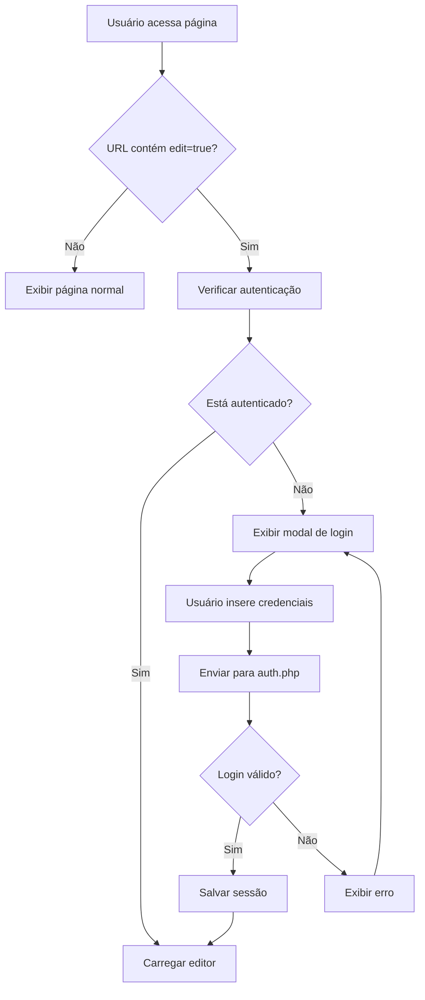

# 📋 Documentação das URLs de Login - Sistema HARDEM

## 🔍 Visão Geral
Este documento apresenta todas as URLs e funcionalidades de login implementadas no sistema HARDEM Editor, um CMS para construção e edição de sites.

---

## 🔐 URLs de Autenticação Implementadas

### 1. **auth.php** - API Principal de Autenticação
**URL:** `auth.php`  
**Método:** `POST`  
**Descrição:** API principal que gerencia toda a autenticação do sistema

#### Ações Disponíveis:
- **`action=login`** - Realizar login
  - **Parâmetros:** `username`, `password`
  - **Resposta:** JSON com status de sucesso e dados do usuário
  
- **`action=logout`** - Realizar logout
  - **Resposta:** JSON confirmando logout
  
- **`action=check`** - Verificar se usuário está autenticado
  - **Resposta:** JSON com status de autenticação e dados do usuário

#### Credenciais:
- **Usuário:** `Hardem`
- **Senha:** `Hardem@321`
- **Timeout da Sessão:** 3600 segundos (1 hora)

---

### 2. **test-login.html** - Página de Teste de Login
**URL:** `test-login.html`  
**Método:** `GET`  
**Descrição:** Interface de teste para validar funcionalidades de login

#### Características:
- ✅ Interface amigável com campos pré-preenchidos
- ✅ Debug visual com informações da URL atual
- ✅ Teste de conectividade com `auth.php`
- ✅ Redirecionamento automático para modo de edição após login
- ✅ Logs detalhados no console do navegador

#### Funcionalidades:
- Formulário de login com validação
- Botão "Testar Login" que chama `auth.php`
- Área de debug mostrando status da conexão
- Redirecionamento para `index.html?edit=true` após sucesso

---

### 3. **admin.html** - Painel Administrativo
**URL:** `admin.html`  
**Método:** `GET`  
**Descrição:** Painel principal de administração do sistema

#### Características:
- ✅ Login administrativo com validação
- ✅ Lista de páginas editáveis
- ✅ Controles de navegação para edição
- ✅ Função de logout integrada

#### Páginas Gerenciadas:
- 🏠 **index.html** - Página Inicial
- ℹ️ **about.html** - Sobre Nós  
- 🔧 **service.html** - Serviços
- 📞 **contact.html** - Contato

---

### 4. **admin-panel.html** - Painel Avançado de Administração
**URL:** `admin-panel.html`  
**Método:** `GET`  
**Descrição:** Interface avançada de administração com gestão completa

#### Recursos:
- ✅ Dashboard com estatísticas
- ✅ Gestão de imagens e textos
- ✅ Sistema de backup
- ✅ Tabelas de controle de conteúdo
- ✅ Upload e gerenciamento de arquivos

---

### 5. **account.html** - Página de Conta (Em Desenvolvimento)
**URL:** `account.html`  
**Método:** `GET`  
**Descrição:** Página de conta do usuário (template padrão do site)

#### Status:
- ⚠️ Página em template padrão
- ⚠️ Não possui funcionalidades de login implementadas
- ⚠️ Usado como template visual do site

---

## 🔧 Sistema de Edição Inline

### URLs com Parâmetro de Edição
**Formato:** `[página].html?edit=true`  
**Descrição:** Qualquer página do site pode ser acessada em modo de edição

#### Exemplos:
- `index.html?edit=true` - Edição da página inicial
- `about.html?edit=true` - Edição da página sobre
- `service.html?edit=true` - Edição da página de serviços
- `contact.html?edit=true` - Edição da página de contato

#### Funcionamento:
1. **Verificação de URL:** Sistema detecta parâmetro `edit=true`
2. **Validação de Autenticação:** Chama `auth.php` com `action=check`
3. **Carregamento do Editor:** Se autenticado, carrega interface de edição
4. **Modal de Login:** Se não autenticado, exibe modal de login inline

---

## 📱 Modais de Login Implementados

### 1. **Modal Principal do Editor Manager**
**Local:** `assets/js/editor-manager.js`  
**Função:** `showLoginModal()`
- ✅ Modal inline com design responsivo
- ✅ Validação de campos em tempo real
- ✅ Integração com `auth.php`
- ✅ Redirecionamento automático após login

### 2. **Modal Manual da Página Principal**
**Local:** `index.html`  
**Função:** `createManualLoginModal()`
- ✅ Modal customizado para página inicial
- ✅ Campos pré-preenchidos para facilitar acesso
- ✅ Design consistente com o tema do site

### 3. **Modal do Sistema de Autenticação**
**Local:** `assets/js/auth.js`  
**Classe:** `HardemAuth`
- ✅ Modal genérico reutilizável
- ✅ Gerenciamento de estado de autenticação
- ✅ Funcionalidades de logout

---

## 🔐 Segurança Implementada

### Recursos de Segurança:
- ✅ **Sessões PHP:** Gerenciamento seguro de sessões
- ✅ **Timeout de Sessão:** Logout automático após 1 hora
- ✅ **Verificação Constante:** Validação de autenticação em tempo real
- ✅ **Sanitização:** Escape de dados de entrada com `encodeURIComponent`
- ✅ **Headers CORS:** Configurados no `api-admin.php`

### Limitações de Segurança:
- ⚠️ **Credenciais Hardcoded:** Usuário/senha fixos no código
- ⚠️ **Sem HTTPS Obrigatório:** Permite acesso via HTTP
- ⚠️ **Sem Rate Limiting:** Não possui proteção contra força bruta

---

## 🚀 Fluxo de Autenticação

---

## 📋 URLs de Teste e Desenvolvimento

### Para Testes:
1. **`test-login.html`** - Teste isolado de login
2. **`index.html?edit=true`** - Teste de edição inline
3. **`admin.html`** - Teste de painel administrativo

### Para Desenvolvimento:
1. **`api-admin.php`** - API de administração
2. **`auth.php`** - API de autenticação
3. **`assets/js/editor-manager.js`** - Gerenciador do editor

---

## 💡 Recomendações de Uso

### Para Administradores:
1. Use **`admin.html`** para gestão geral
2. Use **`admin-panel.html`** para controle avançado
3. Use **`test-login.html`** para diagnosticar problemas

### Para Edição de Conteúdo:
1. Acesse qualquer página com `?edit=true`
2. Faça login quando solicitado
3. Use as ferramentas inline para editar

### Para Desenvolvimento:
1. Use **`test-login.html`** para debugar autenticação
2. Monitore logs no `hardem-editor.log`
3. Use console do navegador para debug JavaScript

---

## 🔧 Configurações Técnicas

### Arquivos de Configuração:
- **`auth.php`** - Configurações de autenticação
- **`config/database.php`** - Configurações do banco
- **`classes/Database.php`** - Classe de conexão

### Dependências JavaScript:
- **`editor-manager.js`** - Gerenciador principal
- **`auth.js`** - Sistema de autenticação
- **`editor-core.js`** - Núcleo do editor

### Logs do Sistema:
- **`hardem-editor.log`** - Log principal do sistema
- Console do navegador - Debug JavaScript

---

**📝 Última atualização:** Janeiro 2024  
**🔧 Versão do Sistema:** HARDEM Editor v1.0  
**👨‍💻 Desenvolvido por:** Equipe HARDEM 